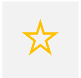

# NJ-web-design

A Design-API using CSS and JavaScript inspirited from Microsoft Fluent Design


## Instructions:

### Developers
* [JAcoder7](https://github.com/JAcoder7 "go to his github-accont")
* [Ncoder77](https://github.com/Ncoder77 "go to his github-accont")
   
### How to use it
This design is based on CSS and Javascript. Here is the Code for implementing the components and html elements. For starting with a project, please download these files:   
```index.html, NJDesgn.css, NJDesign.js```   
For an example page, please download the ```example.html``` file.   
So let's start coding with NJDesign API!

### Initialize

***When you use our design you must first run the JavaScript-function "init();" at the bottom of your html-code:***    
```<script>init();</script>```

### Components
Already implemented and documentated:
- Button
- header (h1, h2, etc.)
- Drop down (select)
- Progressbar
- Navigation

Comings soon:
- Flexbox Design
- Head-image
- Footer

## Button
The button, you can implement it like that:
``` 
<Button>Text of the button</Button>
```
For Javascript: ``` <Button onclick="yourfunction()"></Button> ```   

## Header
There are multiple headers: h1, h2, h3, ...
The ```<h1>``` tag is very good for the title of a sub-page.

## Drop down
This is the syntax for a drop down selection:
```
<select>
    <option value="value1">option 1</option>
    <option value="value2">option 2</option>
</select>
```
The ```value=""``` is for javascript.

## Progressbar
To add a progessbar, add the tag "div" and change the class to "progressbar" and add an Id.  

```
 <div class="progressbar" id="yourID"></div>
```

Next, run the function progressbar(id, width, progress).
Change the id to the Id from the div and change the width(numbers) and the progress(%).

```
<script>
    progressbar("yourID", width, progress);
</script>
```

## Navigation

We've made a navigation, wich looks nice and is easy to use:  
Use the ```<nav>``` tag and insert ```<elem onclick="toggle_menu()"></elem>``` as first element.  
Then insert elements with the tag ```<elem>```.
Add  ```onclick="windowChange(window_num)"``` to the ```<elem>``` tag and insert the number of the window starting with 0.  

To add a window simply add ```<div class="window"> yourCode </div>``` and put your code between the two tags.  
#### Example:
```
<nav>
    <elem onclick="toggle_menu();"></elem> <!--Menubutton-->
    <div onclick="windowChange(0)">my new window</div>
</nav>
```

## Flexbox-view
This is a page layout with flexboxes. You can use a big and asmall layout of the flexboxes. Here is the code for the big one:
```
<!--Big flexbox-view-------------------------------------->
    <div class="flexbox-view">

        <!--Flexbox with image-->
        <div class="flex-item-b">
             <!--Image has to be 100px*100px !-->
            Flexbox with image...        <!--Text-->
        </div>

        <!--Flexbox with icon-->
        <div class="flex-item-b">
            <div class="flexview-icon-b"></div>  <!--These icons have the font 'Segoe MDL2 Assets'-->
            and with MDL2 Assets icon     <!--Text-->
        </div>

        <!--Another two flex-boxes (with image)-->
        <div class="flex-item-b">Item 3</div>
        <div class="flex-item-b">Item 4</div>
    </div>
```
And here for the small flexboxes:
```
<!--Small flexbox-view------------------------------------>
    <div class="flexbox-view">
        <div class="flex-item-s">Item 1</div>
        <div class="flex-item-s"><div class="flexview-icon-s"></div>Item 2</div>
        <div class="flex-item-s">Item 3</div>
        <div class="flex-item-s">Item 4</div>
    </div>
```

## Header image
THe header image is very good for the style of your website. Its the first picture at the top, you can also say the "title" picture. It works with javascript , so you have to implement it like that:   
```
<script>headerImg("yourImage.jpg", 380);</script>
```
First, you add the URL fo your image (```"yourImage.jpg"```), then the size for scaling the image (```380```).

## Icon

We've also added a ```ico``` css-class. It uses the icons from the "Segoe MDL2 Assets" font.  
Simply add a ```span``` tag and add the class:  
```<span class="ico">  </span>```  
Between the two tags you can add your icon from Segoe MDL2 Assets.

## Box

To add a simple box, use the ```div``` tag and enter the class "NJbox".

## comments

To add a comment use the class "note".

## image

We have styled images wich you can use with the class ```NJ-design```.